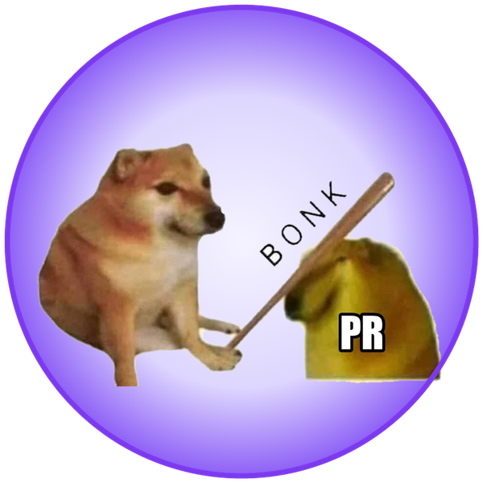
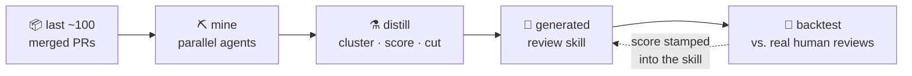

<div align="center">



# pr-review-skill-generator

**A skill that generates a skill to review PRs.**

Mine your last 100 merged PRs into an AI reviewer that knows your business logic,<br/>
your team's past decisions, and the module that has burned you three times.

[](LICENSE)


[Why](#-why) · [How it works](#%EF%B8%8F-how-it-works) · [Quick start](#-quick-start) · [FAQ](#-faq) · [Roadmap](#%EF%B8%8F-roadmap)

</div>

---

## 🧠 Why

AI code reviewers are great at syntax and generic best practices — and blind to
everything that makes review actually hard:

- the invariant your billing code must never violate,
- the "wrong-looking" pattern your team deliberately adopted two years ago,
- the hot path that has produced three hotfixes this quarter.

That knowledge already exists. It's written down in your merged PRs — in review
threads, in the commits that followed them, in the decisions your team defended.
Nobody, human or AI, reads 100 PRs before reviewing yours.

**This tool reads them once, and distills them into a skill your AI reviewer
loads every time.**

## ⚙️ How it works



Every signal in your history becomes a specific kind of knowledge:

| Signal in your merged PRs | What it becomes |
|---|---|
| 💬 Review comment → author pushed a fix | An **enforced rule**, with PR citations |
| 🛡️ "This is intentional because…" → reviewer accepted | A **do-not-flag entry** — kills the false-positive nitpicks generic reviewers spam you with |
| 🚨 "Hotfix for regression from #N" | A rule that would have **caught the miss** — review's most expensive failures |
| 🗣️ Q&A threads and PR descriptions | **Domain glossary + business invariants** |
| 🔥 Where comments and hotfixes cluster | A **risk map** — hot zones get scrutiny, cold zones get skimmed |
| 🤖 AI-reviewer comments your team acted on | Kept. Ignored ones are discarded — AI noise is never laundered into "team knowledge" |

Every mined rule carries provenance (`PR #482, #519`). Your team can audit any
rule back to the discussion it came from — and review findings cite their sources.

## 👀 What a review looks like

````markdown
## Review: refund flow change looks risky — 1 blocker

### 🔴 Blocker — refund can exceed remaining balance
`src/billing/refunds.ts:84` — checks the order total, not the ledger balance;
a partial refund followed by this path double-refunds.
Why: refunds must be computed against the ledger (rule: rules/payments.md, PR #482)
Suggestion:
```diff
- if (amount <= order.total) {
+ if (amount <= ledger.remainingBalance(order.id)) {
```

### 🔵 Consider — new endpoint has no rate-limit annotation
`src/api/routes.ts:112` — every public endpoint added since PR #519 carries one.

Checked and fine: idempotency-key handling, migration ordering, webhook signature paths.
````

Capped at **5 findings**, ranked by severity. If the change is fine, it says so
in one line instead of manufacturing feedback.

## 🎯 It measures itself before you trust it

Generation holds out a handful of human-reviewed PRs, reconstructs the code
*as the reviewer originally saw it*, reviews it blind with the freshly
generated skill, and compares against what your humans actually flagged:

```
backtest: caught 7/11 human concerns on 5 held-out PRs; 1/3 novel findings dubious
```

That number is stamped into the generated skill's metadata. If your repo's
review culture is thin and the skill comes out weak, it tells you that too.

## 🚀 Quick start

> **Requirements:** [Claude Code](https://claude.com/claude-code) and the
> [GitHub CLI](https://cli.github.com), authenticated (`gh auth login`).

```bash
git clone https://github.com/paanSinghCoder/pr-review-skill-generator
cp -r pr-review-skill-generator/pr-review-skill-generator ~/.claude/skills/
```

Then, in Claude Code inside the repo you want a reviewer for:

```
> generate a PR review skill from our merged PRs
```

Answer the setup questions (PR count — default 100, output path, monorepo
scope) and let it run; mining and backtesting take a while. When it's done:

```
> review PR #1234
```

## 📦 What gets generated

```
.claude/skills/pr-review/
├── SKILL.md            # review procedure + path→rules routing table
├── decisions.md        # deliberate patterns — never flagged
├── glossary.md         # domain terms + business invariants
├── hot-zones.md        # risk-weighted attention map
├── context-wanted.md   # things the miner couldn't read — fill these in
└── rules/
    ├── general.md      # cross-cutting mined rules
    └── <domain>.md     # per-domain rules, every one cited
```

Commit this folder to your repo: the whole team gets the same reviewer, and
changes to your review knowledge go through PR review themselves.

## 🔄 Keeping it fresh

The skill stamps its training range (`trained through PR #964`) and nags when
it falls ~150 PRs or 6 months behind. Regeneration is **incremental**: it
mines only new PRs, extends provenance on existing rules, flags contradictions
(your team changed its mind — it asks rather than assumes), and never touches
the `HUMAN-CURATED` sections where your team adds what no miner can infer.

## ❓ FAQ

<details>
<summary><b>Does my code leave my machine?</b></summary>
<br/>

Everything runs locally: PR data is fetched with *your* `gh` auth into a local
work directory. The model backing your Claude Code session sees it — the same
exposure as any AI-assisted review.
</details>

<details>
<summary><b>What does generation cost?</b></summary>
<br/>

Roughly 15–25 agent runs for 100 PRs (parallel mining batches + backtest).
Scale down with a smaller PR count; quality scales with input.
</details>

<details>
<summary><b>Our reviews are mostly "LGTM". Will this work?</b></summary>
<br/>

Honestly: the mined skill will be thin, and the backtest will say so. You
still get the skeleton (routing, hot zones, glossary) and the HUMAN-CURATED
sections to grow it by hand.
</details>

<details>
<summary><b>Why cap reviews at 5 findings?</b></summary>
<br/>

A senior reviewer surfaces the five things that matter, not thirty
observations. Ranking is the feature; volume is noise.
</details>

<details>
<summary><b>Monorepos?</b></summary>
<br/>

Supported via path scoping at generation time — or generate one skill per
sub-tree.
</details>

<details>
<summary><b>Is the generated skill safe to share?</b></summary>
<br/>

Inside your private repo, yes — that's the point. Publicly, no: it is your
business logic, distilled. The <i>generator</i> is safe to share; its
<i>output</i> is not.
</details>

## 🚧 Limitations (v1)

- **GitHub only.** GitLab/Bitbucket are on the roadmap.
- **Review-culture-bound.** It can only learn what your team wrote down.
- **Internal doc links** (Notion, Confluence) can't be fetched; they're queued
  in `context-wanted.md` for a human to summarize.

## 🗺️ Roadmap

- [ ] GitHub Action mode — auto-review on PR open, comment inline
- [ ] GitLab / Bitbucket support
- [ ] Org mode — shared conventions across repos, per-repo domain rules
- [ ] Issue-tracker mining (Linear/Jira) for requirement context

## 🤝 Contributing

Issues and PRs welcome. One rule of the house: changes to the mining or
distillation heuristics should demonstrate improvement — run a generation
before and after on a public repo and compare backtest results in the PR
description.

```
pr-review-skill-generator/
├── SKILL.md                          # orchestration: fetch → mine → distill → backtest
├── scripts/fetch-pr-data.sh          # resumable PR-data fetch (gh only, no jq)
└── references/
    ├── mining-guide.md               # signal taxonomy, bot filtering, miner output contract
    ├── distillation-guide.md         # clustering, scoring, cutting, organizing
    ├── backtest-guide.md             # holdout evaluation procedure
    └── generated-skill-template.md   # exact structure of the generated skill
```

---

<div align="center">

**[MIT](LICENSE)** · built for [Claude Code](https://claude.com/claude-code) · your PRs already know how to review your PRs

</div>
